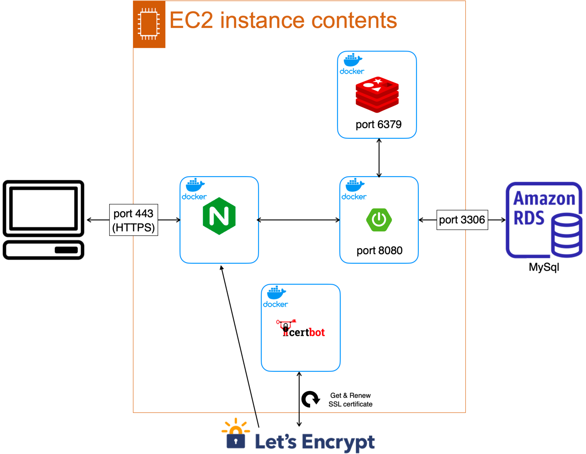

# BankSystem ETC

## Description
BankSystem 배포를 위한 repository입니다.

## 기술 스택
- Spring Boot
- Spring Data JPA
- MySql
- Redis
- Nginx
- Docker
- AWS EC2
- AWS RDS
- AWS Route 53

## 프로젝트 구조

## URL
- ~~https://yshjft.xyz~~
- 현재는 인스턴스 제거하였습니다.

## 문제
- ~~certbot 컨테이너가 off됨(인증서 갱신에 문제 생기지 않을까?)~~   
  ~~→ ./init-letsencrypt.sh 후 docker-compose up을 하지 않았다.~~
  → 해결 완료
    

- ~~SSL 인증서 요청을 너무 많이 하여 현재 HTTPS 접속이 막힘(현재 모든 컨테이너 실행 중지 상태)~~     
  ~~7일 후 해봐야 한다.~~   
  → 해결 완료

## Related Repository
[BankSystem Repository](https://github.com/yshjft/BankSystem)

